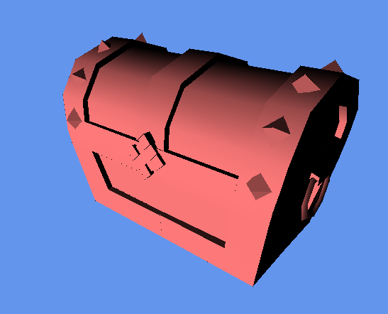

# SoftRender

SoftRender is a simple renderer that tries to emulate a high level OpenGL renderer without having any dependency on it. It's heavily inspired by [ssloy's tinyrenderer tutorials](https://github.com/ssloy/tinyrenderer). The goal behind the project is to teach me about low level rendering and so I've done many things manually for no good reason other than to learn how things work.

Currently it supports 3D scenes, shaders, and model loading. I've currently got a flat shader, and a smooth shader that respects model normals. It looks like this.

I'm very much not finished with it. Here's a list of things I'd like to do still,

- Phong Shading
- Texturing
- Normal Mapping
- Shadows
- Ambient Occlusion
- Anti Aliasing
- Rewrite of maths library
- Performance Improvements

It serves as an ideal testbed for me to learn about graphics and so it'll serve that purpose any time I want to test things out.

# Building and Running

If you'd like to try it out I've made it as easy as I can. 

Included is a premake file, just [download premake from here](https://premake.github.io/download.html#v5) if you don't have it already. Run it from the SoftRender directory with desired action and it will do the rest. For example if you're on windows you may want to use visual studio. In that case you would run `premake5 vs2015`. For OSX users you would run `premake5 xcode4` and so on.

Note that there is one dependency, and that's SDL2. This was a decision to make it easier to run on other platforms. Install SDL2 and edit the `includedirs` and `libdirs` in the premake5.lua file and you should be good to go.

